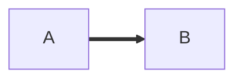

### 

<!-- <a href="https://www.mcraft.dev" target="_blank">  -->
 <!--   -->
 <!-- </a>  -->
 

#### Codewars for fun: 
 
 

 <!--
 #### Stats:

-->

<!-- 

-->

<!--

-->
<!--
**42Matt/42Matt** is a ✨ _special_ ✨ repository because its `README.md` (this file) appears on your GitHub profile.

Here are some ideas to get you started:

- 🔭 I’m currently working on ...
- 🌱 I’m currently learning ...
- 👯 I’m looking to collaborate on ...
- 🤔 I’m looking for help with ...
- 💬 Ask me about ...
- 📫 How to reach me: ...
- 😄 Pronouns: ...
- ⚡ Fun fact: ...
-->
